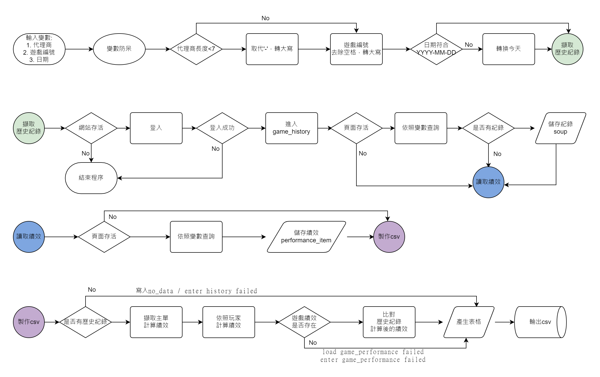
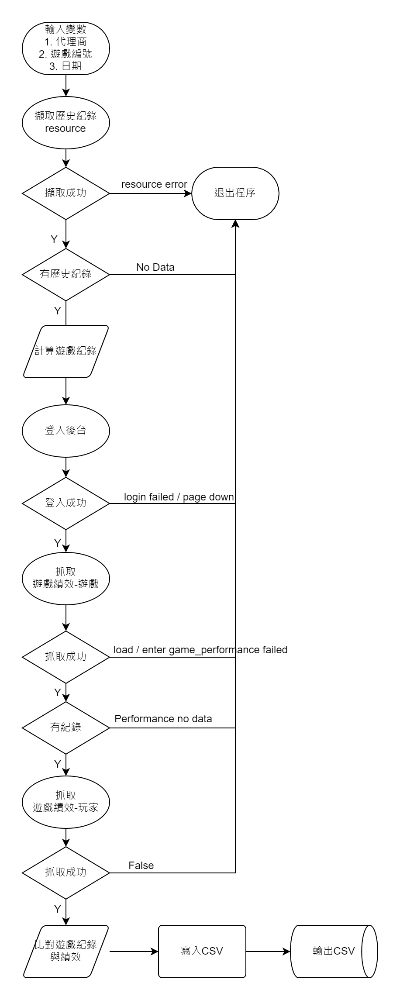

game_performance_Slot 使用說明
----
1. `game_performance_Slot` `chromedriver.exe` 需放在同一層
2. 必要參數
   1. 代理商
   2. 遊戲編號
   3. 日期
3. 執行完成會產生 `代理商_遊戲編號_日期.csv`
4. 資料來源: `br-02 後台`

參數說明
----
### 代理商規格
1. 字數<7 `EX. test-7`
   1. 會將英文轉換大寫，去掉- `EX. TEST7`
2. 其他會依照輸入不轉型防呆 `EX. Test-MultiHost-2`

### 遊戲編號規格
1. 防呆只有將空格去除以及轉換大寫

### 日期規格
1. 指定格式 `YYYY-MM-DD`
2. 不符合規範會轉為當天日期，反之 `當日可以不用輸入日期`

輸出檔案說明
----
1. 內容
   1. 顯示 遊戲編號、代理商
   2. List of History → 歷史紀錄抓取的資料列表
   3. Sum by Player → 依照 `List of History` 抽出玩家資料計算
   4. Sum of History → 依照 `List of History` 的全部資料計算績效需要的值
   5. Comparison Result → 自動比對 `遊戲績效-遊戲`
2. 例外情形
   1. 登入失敗不會產生報表
      1. 網站不存在 `page down`
      2. 無法登入 `login failed1`
      3. 登入後找不到元素 `login failed2`
   2. 以下情形 CSV 內容會顯示內容
      + 遊戲紀錄頁掛掉 `enter history failed`
      + 沒有遊戲紀錄 `no data`
   3. 遊戲績效掛掉 `Comparison Result` 會顯示 `enter game_performance failed`
   4. 進入遊戲績效若遇上跑版之類的例外，無法定位績效資料會顯示 `load game_performance failed`
   5. 遊戲績效沒資料會抓到0，與第 3 4 點不同

流程圖
----

------

game_performance_52 使用說明
----
1. `game_performance_Slot` `chromedriver.exe` `config.ini`需放在同一層
2. 必要參數
   1. 代理商
   2. 遊戲編號
   3. 日期
3. 執行完成會產生 `代理商_遊戲編號_日期.csv`
4. 資料來源: `br-02 後台` `resource`

game_performance_52 執行說明
----
+ 執行檔後加上參數
+ EX. game_performance_52.exe TEST2 PSC-ON-00008 2021-11-15

參數說明
----
### 代理商規格
1. 依照參數1，沒有防呆

### 遊戲編號規格
1. 依照參數2，防呆-將空格去除以及轉換大寫

### 日期規格
1. 依照參數3
2. 指定格式 `YYYY-MM-DD`
3. 不符合規範會轉為當天日期

輸出檔案說明
----
1. 內容
   1. 顯示 遊戲編號、代理商
   2. List of History → 歷史紀錄抓取的資料列表
   3. Game History by room → 依照 `List of History` 抽出房間資料計算
   4. Game History by player → 依照 `List of History` 抽出玩家資料計算
   5. Game performance by room → 依照 `後台-遊戲績效-遊戲` 擷取資料
   6. Game performance by player → 依照 `後台-遊戲績效-玩家` 擷取資料
   7. Comparison Result → 自動比對 `遊戲績效-遊戲` `後台-遊戲績效-玩家`
      1. 比對結果參照欄位 `status`

流程圖
----
